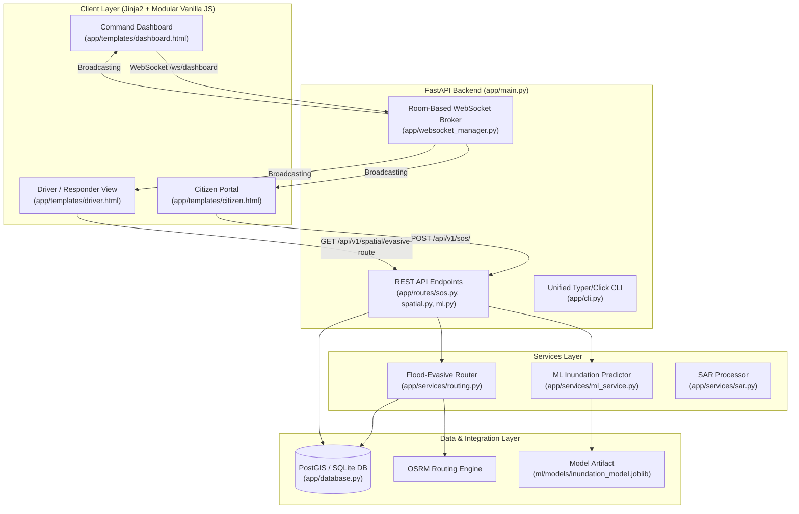

# SurakshaGrid: Real-Time Disaster Response & Spatial Emergency Grid

SurakshaGrid is an open disaster management platform designed to coordinate emergency response during severe flooding and extreme weather events. It integrates spatial hazard analysis, machine learning inundation prediction, evasive emergency vehicle routing, and real-time WebSocket communication to connect citizens, dispatchers, and rescue field teams.

---

## System Architecture



---

## Core Features & Capabilities

- **Real-Time Emergency Lifecycle**: Citizen SOS dispatch, command dashboard alerting, responder assignment, and incident resolution.
- **Flood Inundation Prediction**: Scikit-Learn pipeline predicting water rise and flood probability with a deterministic **Rational Runoff ($Q = C \cdot I \cdot A$)** physics fallback.
- **Spatial Hazard Evasive Routing**: `shapely` & `geopy` corridor intersection testing against SAR/database flood polygons with offline centroid-offset bypass waypoints.
- **Room-Based Event Broadcasting**: Thread-safe WebSocket manager broadcasting alerts across `dashboard`, `responders`, and `citizens` rooms.
- **SAR Satellite Inundation Extractor**: Sentinel-1 Synthetic Aperture Radar (SAR) backscatter speckle filtering and polygon vectorization.

---

## Local Setup & Execution

### Prerequisites

- Python 3.11+
- Virtual environment (`venv`)

### 1. Installation

```bash
# Clone repository
git clone https://github.com/your-org/surakshagrid.git
cd surakshagrid

# Create and activate virtual environment
python -m venv .venv
# On Linux/macOS: source .venv/bin/activate
# On Windows: .venv\Scripts\activate

# Install dependencies
pip install -r requirements.txt
```

### 2. Unified CLI Execution

SurakshaGrid includes a unified command-line interface (`python -m app`) for server execution, database seeding, and model training:

```bash
# Seed the database with realistic demo incidents, shelters, and flood polygons
python -m app seed

# Train the inundation ML model artifact
python -m app train

# Launch the FastAPI web server on http://localhost:8000
python -m app run
```

---

## Containerized Deployment (Docker)

SurakshaGrid is containerized using a multi-stage `Dockerfile` executing as a non-root system user (`appuser` UID 10001).

### Run with Docker Compose

```bash
# Build and launch FastAPI, PostGIS, and OSRM services
docker compose up --build -d

# Check service status and health checks
docker compose ps

# View application logs
docker compose logs -f api
```

The application services will be accessible at:
- **FastAPI Application & Dashboard**: `http://localhost:8000`
- **PostGIS Database**: `localhost:5432`
- **OSRM Routing Engine**: `http://localhost:5000`

---

## Running Automated Tests

Run the complete test suite using `pytest`:

```bash
# Run all unit and integration tests
python -m pytest

# Run tests with verbose output
python -m pytest -v
```

---

## Engineering Highlights

### 1. Flood-Evasive Geospatial Routing Algorithm
When an emergency vehicle requires dispatch, `app/services/routing.py` constructs a spatial corridor between origin and destination coordinates. Using `shapely`, the route line is tested against active flood polygons (`water_depth_m > 0.3m` or `risk_score >= 0.75`). If an intersection occurs, the engine calculates a normal perpendicular vector from the intersecting polygon's centroid to generate safe bypass waypoints around the hazard.

### 2. Hydrodynamic Machine Learning Engine & Physics Fallback
In `app/services/ml_service.py`, a serialized Scikit-learn `.joblib` model assesses flood probability based on live precipitation, elevation, soil saturation, and distance to waterways. If model artifacts are missing or unreadable, the predictor seamlessly falls back to a physical **Rational Runoff Formula**:
$$Q = C \cdot I \cdot A$$
where peak runoff rate $Q$ is computed directly from runoff coefficient $C$, rainfall intensity $I$, and catchment area $A$.

### 3. Room-Based Thread-Safe WebSocket Event Routing
In `app/websocket_manager.py`, client connections are organized into distinct channel rooms (`"dashboard"`, `"responders"`, `"citizens"`). Broadcasters acquire `asyncio.Lock()` to prevent race conditions and automatically prune dead socket connections upon transmission failure or keepalive timeouts.
